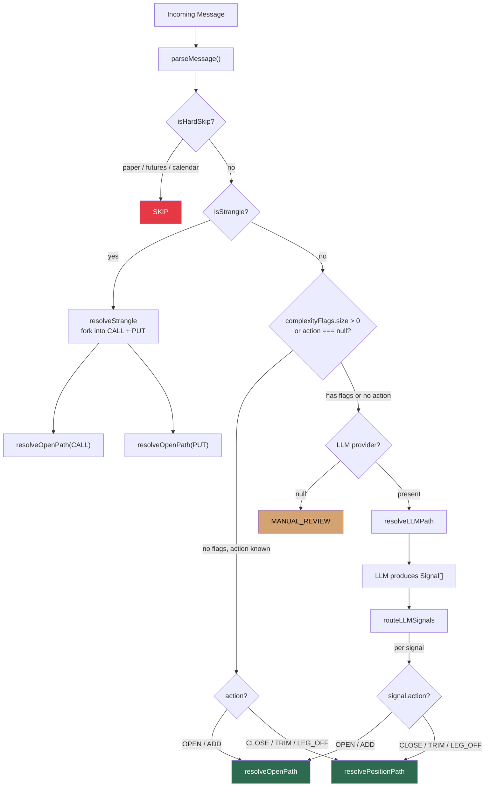

# Orchestrator Architecture

Complete function call map for `src/intents/orchestrator/`.

## Mermaid Diagram — Full Call Graph

```mermaid
flowchart TD
    %% ━━━━━━━━━━━━━━━━━━━━━━━━━━━━━━━━━━━━━━━━━━━━━━━━━━━━━━━━
    %% ENTRY POINT
    %% ━━━━━━━━━━━━━━━━━━━━━━━━━━━━━━━━━━━━━━━━━━━━━━━━━━━━━━━━

    resolveOrchestrator["<b>resolveOrchestrator</b><br/><i>index.ts — PUBLIC API</i>"]

    %% ━━━━━━━━━━━━━━━━━━━━━━━━━━━━━━━━━━━━━━━━━━━━━━━━━━━━━━━━
    %% PARSER (synchronous, zero I/O)
    %% ━━━━━━━━━━━━━━━━━━━━━━━━━━━━━━━━━━━━━━━━━━━━━━━━━━━━━━━━

    subgraph parser["parser.ts — Synchronous Parse"]
        direction TB
        parseMessage["<b>parseMessage</b><br/><i>exported</i>"]
        strikesFromParse["<b>strikesFromParse</b><br/><i>exported → used by open-path</i>"]

        extractStrikes["extractStrikes"]
        extractExpiryHint["extractExpiryHint"]
        extractPremium["extractPremium"]
        extractExitPercent["extractExitPercent"]
        hardSkip["hardSkip"]
        wordCount["wordCount"]

        parseMessage --> extractStrikes
        parseMessage --> extractExpiryHint
        parseMessage --> extractPremium
        parseMessage --> extractExitPercent
        parseMessage --> hardSkip
        parseMessage --> wordCount
    end

    %% ━━━━━━━━━━━━━━━━━━━━━━━━━━━━━━━━━━━━━━━━━━━━━━━━━━━━━━━━
    %% INDEX ROUTING
    %% ━━━━━━━━━━━━━━━━━━━━━━━━━━━━━━━━━━━━━━━━━━━━━━━━━━━━━━━━

    resolveStrangle["resolveStrangle<br/><i>index.ts — private</i>"]

    resolveOrchestrator -->|"1. always"| parseMessage
    resolveOrchestrator -->|"2. isHardSkip → SKIP"| SKIP_OUT(["SKIP"])
    resolveOrchestrator -->|"3. isStrangle"| resolveStrangle
    resolveOrchestrator -->|"4. OPEN/ADD, no flags"| resolveOpenPath
    resolveOrchestrator -->|"5. CLOSE/TRIM/LEG_OFF, no flags"| resolvePositionPath
    resolveOrchestrator -->|"6. flags or action=null"| resolveLLMPath

    resolveStrangle -->|"fork CALL parse"| resolveOpenPath
    resolveStrangle -->|"fork PUT parse"| resolveOpenPath

    %% ━━━━━━━━━━━━━━━━━━━━━━━━━━━━━━━━━━━━━━━━━━━━━━━━━━━━━━━━
    %% OPEN PATH (market data I/O)
    %% ━━━━━━━━━━━━━━━━━━━━━━━━━━━━━━━━━━━━━━━━━━━━━━━━━━━━━━━━

    subgraph openPath["open-path.ts — OPEN/ADD Resolution"]
        direction TB
        resolveOpenPath["<b>resolveOpenPath</b><br/><i>exported, async</i>"]
        resolveExpiryHint["resolveExpiryHint"]
        buildLegsForExpiry["buildLegsForExpiry<br/><i>closure</i>"]
        buildLimitPrice["buildLimitPrice"]
        optionTypeFromStrategy["optionTypeFromStrategy"]

        subgraph dateHelpers["Date Helpers"]
            parseMessageDate["parseMessageDate"]
            dateToYMD["dateToYMD"]
            nextFriday["nextFriday"]
            thisWeekFriday["thisWeekFriday"]
            nextWeekFriday["nextWeekFriday"]
            thirdFriday["thirdFriday"]
            addBusinessDays["addBusinessDays"]
        end

        subgraph strikeHelpers["Strike Helpers"]
            detectStrikeInterval["detectStrikeInterval"]
            roundToInterval["roundToInterval"]
            chainMid["chainMid"]
            findStrikeByPremium["findStrikeByPremium"]
            computeSpreadMid["computeSpreadMid"]
            generateWeeklyExpiries["generateWeeklyExpiries"]
        end

        resolveOpenPath --> parseMessageDate
        resolveOpenPath --> resolveExpiryHint
        resolveOpenPath --> buildLegsForExpiry
        resolveOpenPath --> buildLimitPrice

        resolveExpiryHint --> dateToYMD
        resolveExpiryHint --> nextFriday
        resolveExpiryHint --> thisWeekFriday
        resolveExpiryHint --> nextWeekFriday
        resolveExpiryHint --> thirdFriday
        resolveExpiryHint --> addBusinessDays

        buildLegsForExpiry --> optionTypeFromStrategy
        buildLegsForExpiry --> detectStrikeInterval
        buildLegsForExpiry --> roundToInterval
        buildLegsForExpiry --> findStrikeByPremium
        buildLegsForExpiry --> computeSpreadMid
        buildLegsForExpiry --> chainMid

        resolveOpenPath --> generateWeeklyExpiries
        resolveOpenPath --> computeSpreadMid
        resolveOpenPath --> chainMid

        findStrikeByPremium --> chainMid
    end

    %% ━━━━━━━━━━━━━━━━━━━━━━━━━━━━━━━━━━━━━━━━━━━━━━━━━━━━━━━━
    %% POSITION PATH (DB I/O)
    %% ━━━━━━━━━━━━━━━━━━━━━━━━━━━━━━━━━━━━━━━━━━━━━━━━━━━━━━━━

    subgraph posPath["position-path.ts — CLOSE/TRIM/LEG_OFF Resolution"]
        direction TB
        resolvePositionPath["<b>resolvePositionPath</b><br/><i>exported, async</i>"]
        matchPosition["matchPosition"]
        buildCloseLegs["buildCloseLegs"]
        buildTrimLegs["buildTrimLegs"]
        buildLegOffLegs["buildLegOffLegs"]
        buildReversalLeg["buildReversalLeg"]
        extractUnderlying["extractUnderlying"]
        reverseSide["reverseSide"]
        orderTypeFromLegs["orderTypeFromLegs"]

        resolvePositionPath --> matchPosition
        resolvePositionPath --> buildCloseLegs
        resolvePositionPath --> buildTrimLegs
        resolvePositionPath --> buildLegOffLegs
        resolvePositionPath --> orderTypeFromLegs

        buildCloseLegs --> buildReversalLeg
        buildTrimLegs --> buildReversalLeg
        buildLegOffLegs --> buildReversalLeg

        buildReversalLeg --> extractUnderlying
        buildReversalLeg --> reverseSide
    end

    %% ━━━━━━━━━━━━━━━━━━━━━━━━━━━━━━━━━━━━━━━━━━━━━━━━━━━━━━━━
    %% LLM PATH (LLM + re-routing)
    %% ━━━━━━━━━━━━━━━━━━━━━━━━━━━━━━━━━━━━━━━━━━━━━━━━━━━━━━━━

    subgraph llmPath["llm-path.ts — NLU Fallback"]
        direction TB
        resolveLLMPath["<b>resolveLLMPath</b><br/><i>exported, async</i>"]
        buildNLUPrompt["buildNLUPrompt"]
        routeLLMSignals["routeLLMSignals"]
        signalToParseResult["signalToParseResult"]

        resolveLLMPath --> buildNLUPrompt
        resolveLLMPath --> routeLLMSignals
        routeLLMSignals --> signalToParseResult
    end

    %% Cross-module: open-path imports strikesFromParse from parser
    resolveOpenPath -->|"strike selection"| strikesFromParse

    %% LLM path re-routes through open-path and position-path
    routeLLMSignals -->|"OPEN/ADD signals"| resolveOpenPath
    routeLLMSignals -->|"CLOSE/TRIM/LEG_OFF signals"| resolvePositionPath

    %% ━━━━━━━━━━━━━━━━━━━━━━━━━━━━━━━━━━━━━━━━━━━━━━━━━━━━━━━━
    %% EXTERNAL DEPENDENCIES
    %% ━━━━━━━━━━━━━━━━━━━━━━━━━━━━━━━━━━━━━━━━━━━━━━━━━━━━━━━━

    subgraph external["External Dependencies"]
        spreadLegs["spreadLegs<br/><i>lib/spread-legs.ts</i>"]
        htmlToLLMText["htmlToLLMText<br/><i>parsing/html.ts</i>"]
        formatTimestampForLLM["formatTimestampForLLM<br/><i>lib/et-date.ts</i>"]
        runAgentLoop["runAgentLoop<br/><i>agent/agent-loop.ts</i>"]
        createIntentTools["createIntentTools<br/><i>intents/intent-tools.ts</i>"]
        intentOnToolCall["intentOnToolCall<br/><i>intents/intent-tools.ts</i>"]
    end

    subgraph providers["Injected Providers (via OrchestratorContext)"]
        getQuote["marketData.getQuote"]
        getOptionChain["marketData.getOptionChain"]
        getExpiryDates["marketData.getExpiryDates"]
        getPositions["positions.getPositions"]
        getRecentMessages["chatHistory.getRecentMessages"]
    end

    buildLegsForExpiry --> spreadLegs
    buildLegsForExpiry --> getQuote
    buildLegsForExpiry --> getOptionChain
    resolveOpenPath --> getExpiryDates
    resolveOpenPath --> getOptionChain
    resolveOpenPath --> getQuote

    buildNLUPrompt --> htmlToLLMText
    buildNLUPrompt --> formatTimestampForLLM
    resolveLLMPath --> runAgentLoop
    resolveLLMPath --> createIntentTools
    resolveLLMPath --> intentOnToolCall
    createIntentTools -.->|"tool callback"| getRecentMessages

    resolvePositionPath --> getPositions

    %% ━━━━━━━━━━━━━━━━━━━━━━━━━━━━━━━━━━━━━━━━━━━━━━━━━━━━━━━━
    %% STYLING
    %% ━━━━━━━━━━━━━━━━━━━━━━━━━━━━━━━━━━━━━━━━━━━━━━━━━━━━━━━━

    classDef public fill:#2d6a4f,stroke:#1b4332,color:#fff
    classDef exported fill:#264653,stroke:#1d3557,color:#fff
    classDef private fill:#495057,stroke:#343a40,color:#fff
    classDef ext fill:#9d4edd,stroke:#7b2cbf,color:#fff
    classDef prov fill:#e76f51,stroke:#c1440e,color:#fff
    classDef outcome fill:#d4a373,stroke:#b08968,color:#000

    class resolveOrchestrator public
    class parseMessage,strikesFromParse,resolveOpenPath,resolvePositionPath,resolveLLMPath exported
    class SKIP_OUT outcome
    class spreadLegs,htmlToLLMText,formatTimestampForLLM,runAgentLoop,createIntentTools,intentOnToolCall ext
    class getQuote,getOptionChain,getExpiryDates,getPositions,getRecentMessages prov
```

## Mermaid Diagram — Routing Decision Tree

---

## File-by-File Function Reference

### `types.ts` — Type Definitions Only

No functions. Defines the contract between all other files.

| Type | Purpose |
|---|---|
| `OptionLeg` / `StockLeg` / `Leg` | Concrete broker instruction legs (discriminated union on `type`) |
| `ResolvedSignal` | Fully concrete output: orderType + legs + optional limitPrice/tradeId/exitPercent |
| `OrchestratorResult` | Discriminated union: `EXECUTE` / `SKIP` / `MANUAL_REVIEW` |
| `OrchestratorContext` | All injected deps: message data + market data + positions + chat history |
| `ParseResult` | Internal: everything derivable from text/badges without I/O |
| `StrikeSelection` | Internal: how strikes will be resolved (`explicit` / `delta` / `atm` / `premium_match`) |
| `ComplexityFlag` | Internal: why a message needs the LLM (`extra_text` / `multi_ticker` / `relational` / `mixed_action`) |
| Provider interfaces | `OrchestratorMarketDataProvider`, `PositionProvider`, `ChatHistoryProvider` |

---

### `index.ts` — Entry Point & Router

#### `resolveOrchestrator(ctx, provider?)` — PUBLIC API

The single entry point. Routes messages to the cheapest resolution path.

| Step | Condition | Calls | Why |
|---|---|---|---|
| 1 | Always | `parseMessage(ctx)` | Extract all deterministic fields from text+badges before any I/O |
| 2 | `parse.isHardSkip` | — | Paper trades, futures, calendar spreads → immediate SKIP, no cost |
| 3 | `parse.isStrangle` | `resolveStrangle()` | Strangles decompose into 2 independent OPEN signals |
| 4 | No flags + OPEN/ADD | `resolveOpenPath()` | Deterministic open: market data only, no LLM |
| 5 | No flags + CLOSE/TRIM/LEG_OFF | `resolvePositionPath()` | Deterministic close: DB lookup only, no LLM |
| 6 | Has flags or action=null | `resolveLLMPath()` | NLU needed: casual language, follow-trades, multi-ticker, etc. |

#### `resolveStrangle(parse, ctx)` — private

Forks a strangle/straddle parse into two independent OPEN signals (one CALL, one PUT). Both resolve through `resolveOpenPath` in parallel via `Promise.all`. Collects results: if either produces signals, returns EXECUTE; if both fail, returns MANUAL_REVIEW.

**Why it exists**: Strangles are two independent positions (a call and a put) but arrive in a single message. Decomposing early means the open-path handles each leg as a simple naked option — no special strangle logic needed downstream.

---

### `parser.ts` — Synchronous Message Parser

#### `parseMessage(ctx)` — exported

Zero I/O. Applies regex patterns and badge logic to produce a `ParseResult`. Called exactly once per message by `resolveOrchestrator`.

**Internal call chain**:

| Helper | Called when | What it does |
|---|---|---|
| `hardSkip(reason)` | Paper trade / futures / calendar detected | Returns a ParseResult with `isHardSkip=true`, all fields null |
| `extractStrikes(text)` | Always | Finds explicit strike prices: slash pairs (`180/185`), dollar-prefixed (`$580`), near option keywords (`$180 calls`) |
| `extractExpiryHint(text, isLotto)` | Always | Finds temporal hints: `0DTE`, `overnight`, `next week`, `Oct 17`, `3/6`, bare month names |
| `extractPremium(text)` | Always | Finds stated premium: `for $2.10`, `at $1.20`, `0.63 credit` |
| `extractExitPercent(text)` | Exit badge present or exit verb detected | Finds trim fractions: `half` → 0.5, `1/3` → 0.333, `75%` → 0.75 |
| `wordCount(text)` | After action+strategy are determined | If >15 words, sets `extra_text` complexity flag (signals verbose message that may contain nuance) |

**Parse logic order**:
1. Hard skip checks (paper, futures, Long+Short without strangle keyword)
2. Complexity flag detection (multi_ticker, relational, mixed_action)
3. Symbol extraction (first from pre-extracted `symbols[]`)
4. Strategy detection (CDS > PCS > PDS > LEAP > lotto > STOCK > naked CALL/PUT)
5. Direction derivation (strategy-default → badge override for STOCK → verb override)
6. Action determination (Exit badge → LEG_OFF/TRIM/CLOSE; Long/Short badge → OPEN; verbs → fallback)
7. Strike/expiry/premium extraction

#### `strikesFromParse(parse)` — exported

Determines the `StrikeSelection` method from a `ParseResult`. Used by the open-path (via `strikeSelectionFromParse`, which is a near-duplicate — see note below).

| Priority | Condition | Method | Why |
|---|---|---|---|
| 1 | Explicit strikes in text | `explicit` | Trader said exactly which strikes to use |
| 2 | `parse.isLotto` | `delta` (target=0.70, bias=nearest) | Lotto = speculative OTM buy, pick by delta |
| 3 | Premium stated, no strikes | `premium_match` | Find strike whose mid matches stated price |
| 4 | Fallback | `atm` | No information → at-the-money |

Canonical implementation lives in `parser.ts`. Consumed by `open-path.ts` for production resolution.

---

### `open-path.ts` — OPEN/ADD Signal Resolution

#### `resolveOpenPath(parse, ctx)` — exported, async

Takes a ParseResult (action=OPEN/ADD) and produces a `ResolvedSignal` with concrete legs, strikes, and expiry. This is where market data I/O happens.

**Step-by-step**:

| Step | Function(s) called | Why |
|---|---|---|
| 1. Validate | — | Bail to MANUAL_REVIEW if symbol, strategy, or direction is missing |
| 2. Resolve expiry | `parseMessageDate()` → `resolveExpiryHint()` | Convert text hint (`"next week"`, `"Oct 17"`) to YYYY-MM-DD |
| 3. Choose strike method | `strikesFromParse()` (from parser.ts) | Decide how strikes will be selected |
| 4. Build legs | `buildLegsForExpiry()` | Use market data to resolve strikes and construct option/stock legs |
| 5. Premium scan | `generateWeeklyExpiries()` + loop of `buildLegsForExpiry()` | When no expiry but premium stated: scan multiple expiries until one matches |
| 6. Premium validation | `ctx.marketData.getOptionChain()` + `computeSpreadMid()` / `chainMid()` | When premium and expiry both known: verify market mid is within 5% of stated price |
| 7. Assemble signal | `buildLimitPrice()` | Sign the limit price (positive=debit, negative=credit) and return ResolvedSignal |

#### Internal helpers

**Date helpers** (called by `resolveExpiryHint`):

| Function | Purpose |
|---|---|
| `parseMessageDate(timestamp)` | Parse ISO timestamp to Date |
| `dateToYMD(date)` | Format Date as `YYYY-MM-DD` |
| `nextFriday(from)` | Next Friday on or after `from` |
| `thisWeekFriday(from)` | Friday of the current week |
| `nextWeekFriday(from)` | Friday of the next Mon-Sun week |
| `thirdFriday(year, month)` | Monthly expiry (3rd Friday) |
| `addBusinessDays(date, n)` | Skip weekends when advancing days |

**`resolveExpiryHint(hint, messageDate)`** — Converts text to date. Maps: `0DTE` → same day, `LEAP` → +1 year, `overnight` → +1 business day, `next friday` / `this week` / `next week` → calendar math, `3/6` → slash date, `Oct 17` → month+day, `oct` → third Friday of that month.

**Strike helpers** (called by `buildLegsForExpiry`):

| Function | Purpose |
|---|---|
| `detectStrikeInterval(price, chainStrikes?)` | Infer strike spacing ($0.50/$1/$5/$10) from chain or price level |
| `roundToInterval(price, interval)` | Round to nearest strike increment |
| `chainMid(bid, ask)` | Midpoint of an option quote |
| `findStrikeByPremium(chain, target)` | Scan chain for strike whose mid is closest to target premium |
| `computeSpreadMid(chain, buy, sell)` | Spread debit/credit from two strikes' mids |
| `generateWeeklyExpiries(from, count)` | Generate candidate expiry dates for premium scanning |

**`buildLegsForExpiry(expiry)`** — Closure inside `resolveOpenPath`. Routes by strike selection method:

| Method | Logic |
|---|---|
| `explicit` | Use strikes from text. For spreads: call `spreadLegs()`. For naked: single leg with direction-derived side. |
| `atm` | Get stock quote → round to interval → build leg(s). For spreads: ATM + 1 interval OTM. |
| `delta` | Get option chain → find strike nearest target delta. Fallback to ATM if no delta data. |
| `premium_match` | Get chain → scan all strike combinations → find closest mid to stated premium. Reject if >5% off. |

**`buildLimitPrice(price, strategy, direction)`** — Signs the limit: credit strategies (PCS, SHORT direction) get negative; debit strategies get positive.

**`optionTypeFromStrategy(strategy)`** — `CALL`/`CDS` → CALL; everything else → PUT.

**External dependency**: `spreadLegs()` from `lib/spread-legs.ts` — given a spread strategy and two strikes, returns the correct BUY/SELL sides for each leg (e.g., CDS: BUY lower call, SELL upper call).

---

### `position-path.ts` — CLOSE/TRIM/LEG_OFF Resolution

#### `resolvePositionPath(parse, ctx)` — exported, async

Takes a ParseResult (action=CLOSE/TRIM/LEG_OFF) and produces reversal legs against an existing open position. Only I/O is the position lookup.

**Step-by-step**:

| Step | Function(s) called | Why |
|---|---|---|
| 1. Validate | — | Require symbol and valid action |
| 2. Fetch positions | `ctx.positions.getPositions(symbol)` | Get open positions for this underlying |
| 3. Match position | `matchPosition()` | Fuzzy match: symbol → strategy → direction → single candidate |
| 4. Build legs | `buildCloseLegs()` / `buildTrimLegs()` / `buildLegOffLegs()` | Reverse the position legs for the given action |
| 5. Assemble signal | `orderTypeFromLegs()` | Return ResolvedSignal with tradeId (for position tracking) |

#### Internal helpers

**`matchPosition(positions, parse)`** — Fuzzy position matching:

| Priority | Filter | Fallback |
|---|---|---|
| 1 | Symbol exact match | If 0 matches → MANUAL_REVIEW |
| 2 | Strategy match | If 0 strategy matches but only 1 symbol match → use it (fuzzy fallback) |
| 3 | Direction tie-break | If multiple candidates, prefer matching direction; default to LONG |

**Why fuzzy matching**: Traders say "closed my AAPL calls" but might have an AAPL CDS. Strategy label doesn't always match the exit message's vocabulary.

**`buildCloseLegs(position, symbol)`** — Reverse all legs at full position quantity.

**`buildTrimLegs(position, symbol, exitPercent)`** — Reverse all legs at `round(quantity * exitPercent)`. Rejects if rounds to 0.

**`buildLegOffLegs(position, symbol, targetStrategy)`** — Close only ONE leg of a spread:
- `targetStrategy=CALL` → keep the CALL leg → close the non-CALL leg
- Same option type on both legs (vertical spread) → close the SELL leg
- Fallback → close the SELL leg

**`buildReversalLeg(positionLeg, symbol, quantity)`** — Flip BUY↔SELL, copy strike/expiry/optionType, calls `extractUnderlying()` to normalize OCC symbols back to tickers.

**`extractUnderlying(occOrTicker)`** — Strips OCC suffix: `"AAPL  260307C00180000"` → `"AAPL"`.

**`reverseSide(side)`** — `BUY` → `SELL`, `SELL` → `BUY`.

**`orderTypeFromLegs(legs)`** — ≥2 legs → SPREAD; stock leg → STOCK; else SINGLE.

---

### `llm-path.ts` — NLU Fallback

#### `resolveLLMPath(parse, ctx, provider)` — exported, async

Last resort when the parser couldn't fully resolve the message. Runs an LLM agent loop, then re-routes each LLM-produced signal through the deterministic paths.

**Step-by-step**:

| Step | Function(s) called | Why |
|---|---|---|
| 1. Build prompt | `buildNLUPrompt()` | Assemble message text + pre-parsed fields for the LLM |
| 2. Create tools | `createIntentTools()` | Give the LLM `submit_decision` and `get_recent_chat` tools |
| 3. Run agent | `runAgentLoop()` | LLM classifies and calls a tool to submit its decision |
| 4. Check result | — | Handle null result, SKIP, MANUAL_REVIEW |
| 5. Route signals | `routeLLMSignals()` | Convert LLM Signal[] to ParseResults, route through open/position paths |

#### Internal helpers

**`buildNLUPrompt(parse, ctx)`** — Constructs the user prompt:
- Calls `htmlToLLMText(ctx.rawHtml)` — converts HTML badges to `<LONG BADGE />` markers
- Calls `formatTimestampForLLM(ctx.timestamp)` — human-readable ET datetime
- Includes pre-parsed fields so the LLM knows what's already determined
- Includes complexity flags so the LLM knows why it was called

**`routeLLMSignals(llmSignals, originalParse, ctx)`** — For each LLM-produced signal:
1. Call `signalToParseResult()` to merge LLM output with original parse
2. Route OPEN/ADD → `resolveOpenPath()`, CLOSE/TRIM/LEG_OFF → `resolvePositionPath()`
3. Collect results; any EXECUTE signals win, SKIP sub-signals are ignored

**Why re-route instead of using LLM output directly**: The LLM only handles NLU (what action, what symbol, what strategy). It does NOT resolve strikes, expiry, or legs — those are always resolved by market data (open-path) or position lookup (position-path). This keeps the LLM's job minimal and the resolution deterministic.

**`signalToParseResult(signal, originalParse)`** — Merges LLM-derived fields with parser-derived fields. Parser is authoritative when non-null; LLM fills gaps. Clears complexity flags (the LLM has resolved the ambiguity).

---

## Key Design Decisions

1. **Parser-first**: Every message goes through `parseMessage()` synchronously before any I/O. This is the cheapest possible gate — regex-based, deterministic, instant.

2. **Cheapest path wins**: Hard skip (0 cost) → open-path (market data only) → position-path (DB only) → LLM ($$). Most messages resolve without LLM.

3. **LLM re-routes through deterministic paths**: The LLM never produces final legs/strikes/expiry. It only classifies intent. Resolution always goes through open-path or position-path for consistency.

4. **Complexity flags as routing signals**: The parser doesn't try to handle hard cases. It flags them (`extra_text`, `multi_ticker`, `relational`, `mixed_action`) and routes to the LLM, avoiding brittle regex for nuanced language.

5. **Strangle decomposition at the router**: Handled in `index.ts` before reaching any path. Each leg resolves independently, allowing parallel resolution with no shared state.
