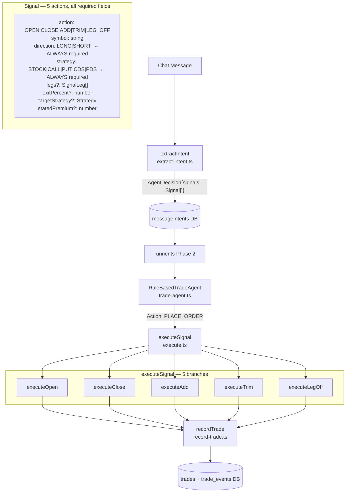
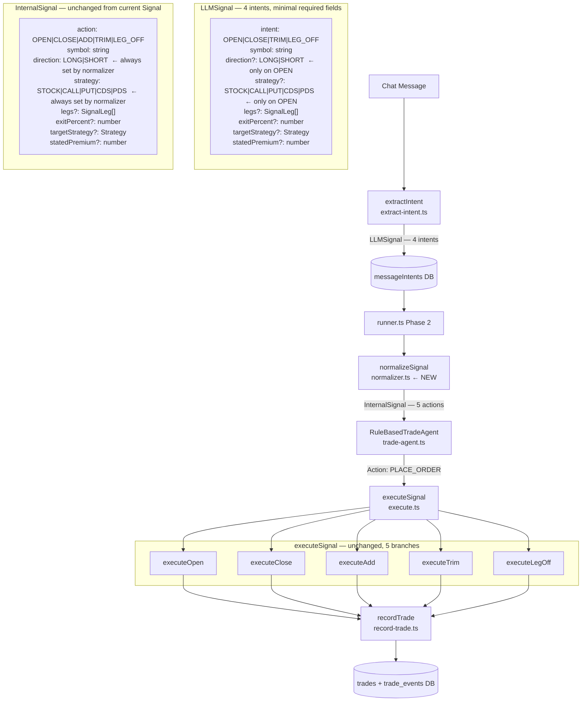
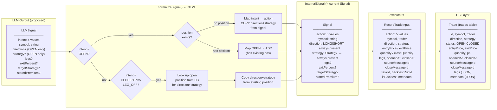
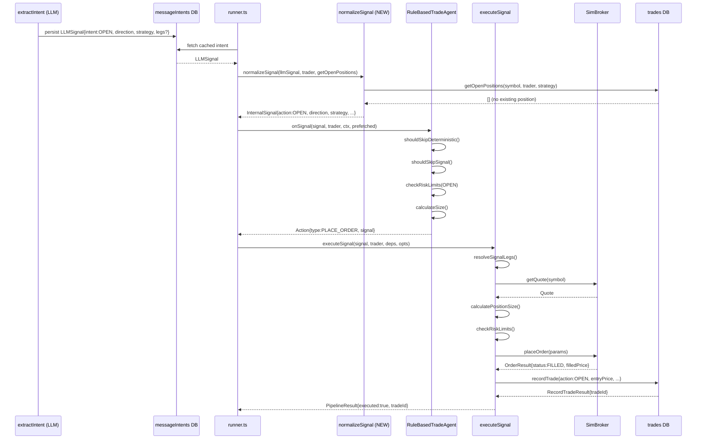
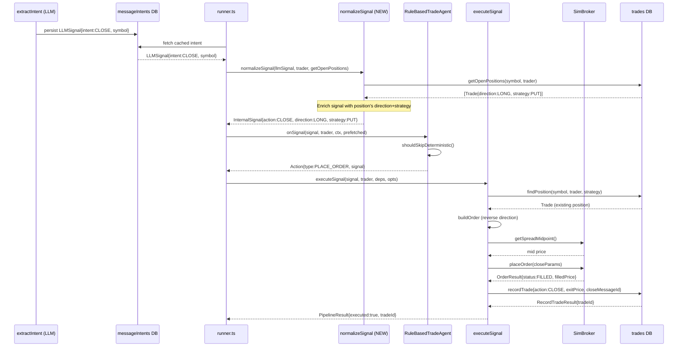
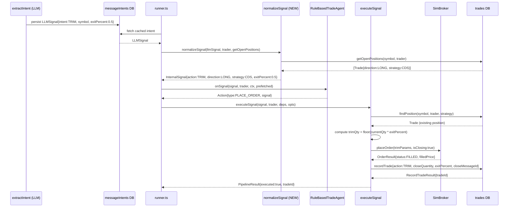
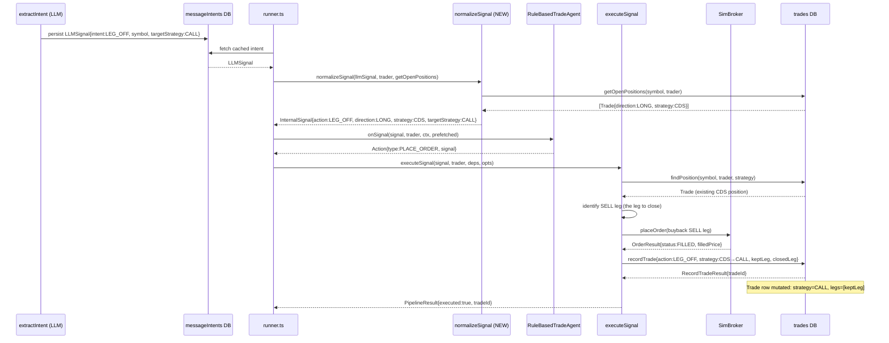
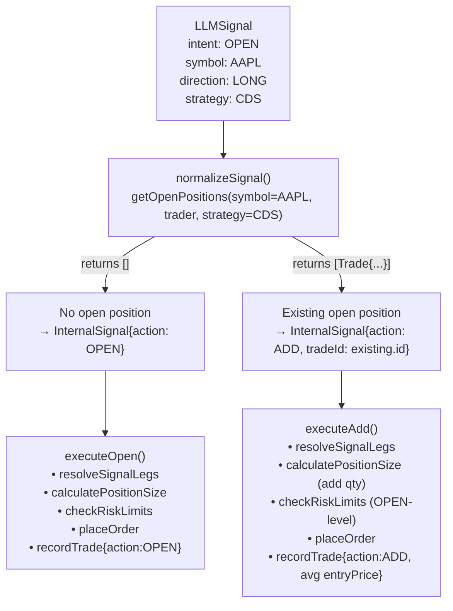

# Signal Redesign — Architecture Diagrams

**Context**: Redesigning the signal taxonomy so the LLM outputs 4 intents (OPEN/CLOSE/TRIM/LEG_OFF) with direction+strategy only required on OPEN. A normalizer maps LLM output to the existing 5 internal actions (OPEN/CLOSE/ADD/TRIM/LEG_OFF).

---

## 1. Current vs Proposed Signal Flow

### Current Flow

### Proposed Flow

**Key difference**: The normalizer sits between the cached intent and the trade agent. It maps LLM OPEN without position → OPEN, LLM OPEN with position → ADD, and enriches CLOSE/TRIM/LEG_OFF with direction+strategy from the existing DB position.

---

## 2. Type Transformation Chain

### Field presence by action

| Field | LLMSignal OPEN | LLMSignal CLOSE/TRIM/LEG_OFF | InternalSignal (all) | RecordTradeInput |
|---|---|---|---|---|
| `action/intent` | `intent: OPEN` | `intent: CLOSE/TRIM/LEG_OFF` | `action: OPEN/CLOSE/ADD/TRIM/LEG_OFF` | `action` (same 5) |
| `symbol` | required | required | required | required |
| `direction` | required | omitted | required (set by normalizer) | required for OPEN/ADD, copied from position for CLOSE/TRIM/LEG_OFF |
| `strategy` | required | omitted | required (set by normalizer) | required for OPEN/ADD, copied from position for CLOSE/TRIM/LEG_OFF |
| `legs` | optional (explicit strikes) | omitted | optional | optional (pipeline infers if absent) |
| `exitPercent` | N/A | TRIM only | TRIM only | TRIM only |
| `targetStrategy` | N/A | LEG_OFF only | LEG_OFF only | LEG_OFF via metadata |
| `statedPremium` | optional | omitted | optional | not forwarded (informational) |

---

## 3. Sequence Diagrams — 4 LLM Intents

### 3a. OPEN Intent → executeOpen

### 3b. CLOSE Intent → executeClose (or ADD if position exists for OPEN)

### 3c. TRIM Intent → executeTrim

### 3d. LEG_OFF Intent → executeLegOff

---

## 4. Data Flow — Fields Set/Read/Ignored at Each Stage

```mermaid
flowchart TD
    subgraph LLM_Stage ["Stage 1: LLM (extract-intent.ts)"]
        LLM_SET["SETS:\n• intent (4 values)\n• symbol\n• direction (OPEN only)\n• strategy (OPEN only)\n• legs (if trader stated strikes)\n• exitPercent (TRIM only)\n• targetStrategy (LEG_OFF only)\n• statedPremium (optional)"]
        LLM_IGNORE["IGNORES:\n• quantity (pipeline sizes)\n• prices (pipeline prices)\n• tradeId (unknown at parse time)"]
    end

    subgraph Norm_Stage ["Stage 2: normalizeSignal (NEW — normalizer.ts)"]
        NORM_SET["SETS:\n• action (maps intent → OPEN/CLOSE/ADD/TRIM/LEG_OFF)\n• direction (CLOSE/TRIM/LEG_OFF: copied from DB position)\n• strategy (CLOSE/TRIM/LEG_OFF: copied from DB position)"]
        NORM_READ["READS:\n• intent, symbol, trader\n• existing open position (DB query)"]
        NORM_PASSTHROUGH["PASSES THROUGH:\n• symbol, legs, exitPercent\n• targetStrategy, statedPremium"]
    end

    subgraph Agent_Stage ["Stage 3: RuleBasedTradeAgent (trade-agent.ts)"]
        AGENT_READ["READS:\n• action (OPEN/ADD → risk + sizing)\n• strategy (strategy gate)\n• symbol (risk check)\n• statedPremium (position sizing estimate)\n• legs (has legs? → can pre-size)"]
        AGENT_SET["SETS:\n• quantity (pre-sizing estimate)\n• order.legs (buildOrderFromSignal)"]
        AGENT_IGNORE["IGNORES:\n• exitPercent (pipeline computes trimQty)\n• targetStrategy (pipeline handles LEG_OFF)"]
    end

    subgraph Pipeline_Stage ["Stage 4: executeSignal (execute.ts)"]
        PIPE_READ["READS (all fields):\n• action → routes to executor\n• symbol, direction, strategy\n• legs (or infers via resolveSignalLegs)\n• exitPercent → trimQty calculation\n• targetStrategy → legToClose lookup"]
        PIPE_SET["SETS (RecordTradeInput):\n• entryPrice / exitPrice (from broker fill)\n• quantity (from sizer)\n• openedAt / closedAt (fill timestamp)\n• sourceMessageId (OPEN/ADD)\n• closeMessageId (CLOSE/TRIM/LEG_OFF)\n• backtestRunId, isBacktest\n• metadata (LEG_OFF: keptLeg, closedLeg)"]
        PIPE_IGNORE["IGNORES:\n• statedPremium (informational only)\n• LLM intent field (already mapped to action)"]
    end

    subgraph RecordTrade_Stage ["Stage 5: recordTrade (record-trade.ts)"]
        RT_READ["READS:\n• action → INSERT/UPDATE branch\n• tradeId → fast path vs scope query\n• direction, strategy, quantity\n• entryPrice, exitPrice\n• openedAt, closedAt\n• sourceMessageId, closeMessageId\n• backtestRunId (scopes all queries)"]
        RT_SET["SETS (trades table):\n• id (UUID)\n• status: OPEN → CLOSED\n• pnl (computeTradePnl)\n• realizedPnl (accumulated TRIMs)\n• avgEntryPrice (ADD: weighted avg)\n• legs mutation (LEG_OFF: kept leg only)"]
        RT_EMITS["EMITS (trade_events):\n• Immutable event per action\n• price, quantity, messageId, timestamp\n• metadata (LEG_OFF: keptLeg, closedLeg)"]
    end

    LLM_Stage --> Norm_Stage
    Norm_Stage --> Agent_Stage
    Agent_Stage --> Pipeline_Stage
    Pipeline_Stage --> RecordTrade_Stage
```

---

## 5. OPEN Intent Normalization: OPEN vs ADD Decision

This diagram shows how the normalizer distinguishes a new position (OPEN) from an add-to-position (ADD) — a distinction the LLM no longer needs to make.

---

## 6. Normalizer Edge Cases

```mermaid
flowchart TD
    subgraph EC1 ["Edge Case: CLOSE with no open position"]
        EC1_IN["LLMSignal{intent:CLOSE, symbol:AAPL}"]
        EC1_NORM["normalizeSignal: getOpenPositions → []"]
        EC1_OUT["InternalSignal{action:CLOSE, direction:LONG*, strategy:STOCK*}\n* fallback defaults — pipeline will return executed:false"]
        EC1_IN --> EC1_NORM --> EC1_OUT
    end

    subgraph EC2 ["Edge Case: CLOSE with strategy mismatch (fuzzy match)"]
        EC2_IN["LLMSignal{intent:CLOSE, symbol:AAPL}"]
        EC2_NORM["normalizeSignal: getOpenPositions(symbol=AAPL) → [Trade{strategy:PUT}]"]
        EC2_OUT["InternalSignal{action:CLOSE, direction from pos, strategy from pos}\nfindPosition() in executeClose does own fuzzy fallback"]
        EC2_IN --> EC2_NORM --> EC2_OUT
    end

    subgraph EC3 ["Edge Case: OPEN with allowedStrategies gate"]
        EC3_IN["LLMSignal{intent:OPEN, strategy:CDS}"]
        EC3_GATE["normalizeSignal → InternalSignal{action:OPEN}\nAgent: shouldSkipSignal(signal, allowedStrategies=['STOCK','PUT'])\n→ NO_OP (strategy not allowed)"]
        EC3_IN --> EC3_GATE
    end

    subgraph EC4 ["Edge Case: LEG_OFF enrichment"]
        EC4_IN["LLMSignal{intent:LEG_OFF, symbol:UNH, targetStrategy:CALL}"]
        EC4_NORM["normalizeSignal: getOpenPositions → [Trade{direction:LONG, strategy:CDS}]\nSets direction:LONG, strategy:CDS on InternalSignal"]
        EC4_OUT["InternalSignal{action:LEG_OFF, direction:LONG, strategy:CDS, targetStrategy:CALL}"]
        EC4_IN --> EC4_NORM --> EC4_OUT
    end
```

---

## Summary: What Changes vs What Stays

| Component | Status | Change |
|---|---|---|
| `extract-intent.ts` prompt | **CHANGES** | Remove ADD from outputs; direction/strategy optional on CLOSE/TRIM/LEG_OFF |
| `agent/schemas.ts` — `SignalSchema` | **CHANGES** | Rename to `LLMSignalSchema`; `intent` replaces `action`; direction/strategy optional |
| `normalizer.ts` | **NEW** | Maps `LLMSignal` → `InternalSignal`; OPEN+position → ADD; enriches direction/strategy |
| `agent/schemas.ts` — `InternalSignalSchema` | **UNCHANGED** (= current `SignalSchema`) | All 5 actions, direction+strategy always required |
| `trading/trade-agent.ts` | **UNCHANGED** | Receives `InternalSignal`, same logic |
| `pipeline/execute.ts` | **UNCHANGED** | Receives `InternalSignal`, same 5-branch switch |
| `trades/record-trade.ts` | **UNCHANGED** | Receives `RecordTradeInput`, same logic |
| `backtest/runner.ts` | **MINIMAL CHANGE** | Call `normalizeSignal()` before `tradeAgent.onSignal()` |
| `messageIntents` DB table | **SCHEMA CHANGE** | `signals` JSON column stores `LLMSignal[]` instead of `Signal[]` |
| DB `trades` table | **UNCHANGED** | Still stores 5 internal actions |
