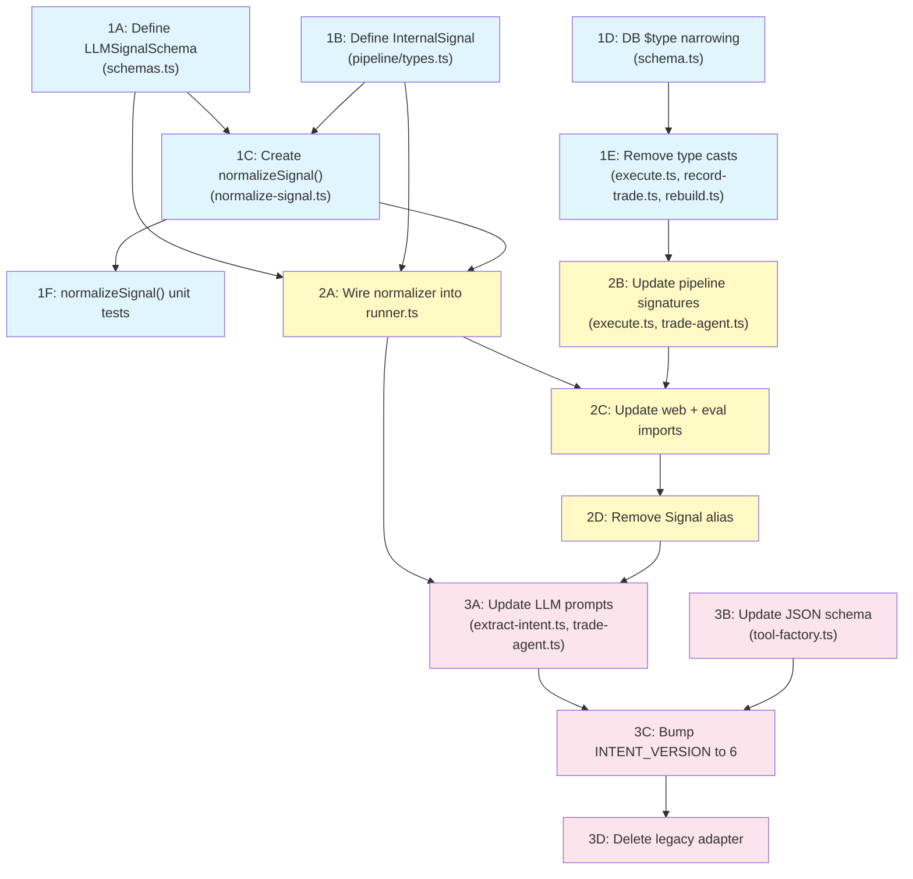

# Signal Redesign — Master Implementation Plan

**Status**: IMPLEMENTED (simplified). Original 6-doc plan was over-engineered.
**Date**: 2026-02-23
**Implemented**: 2026-02-23

---

## Implementation Status (2026-02-23)

**What was implemented** (simplified 5-change approach, 0 new type files):

1. **DB $type annotations**: `$type<Direction>()` / `$type<Strategy>()` on `trades.direction`, `trades.strategy`, `tradeEvents.direction`, `tradeEvents.strategy` in `src/db/schema.ts` — eliminated ~15 `as 'LONG' | 'SHORT'` / `as Signal['strategy']` casts from `execute.ts`, `record-trade.ts`, `rebuild.ts`, `filters.ts`
2. **OPEN-to-ADD routing**: `executeSignal()` in `execute.ts` now checks for existing positions when action is OPEN and routes to `executeAdd()` — LLM no longer needs to distinguish OPEN vs ADD
3. **Prompt overhaul**: Rewrote `INTENT_SYSTEM_PROMPT` in `extract-intent.ts` — removed ADD from LLM vocabulary, made direction/strategy optional on exit signals, added examples for "adding more" (= OPEN), disambiguation hints, and single-signal-per-symbol rule
4. **Tool schema update**: `tool-factory.ts` removed ADD from action enum, reduced required fields to `['action', 'symbol']`, narrowed `targetStrategy` to `['CALL', 'PUT']`
5. **INTENT_VERSION bump**: 5 to 6 in `extract-intent.ts` — forces re-extraction of all cached intents
6. **Quote reuse optimization**: `resolveSignalLegs()` returns stockQuote for reuse in `getEntryPriceEstimate()`, avoiding redundant broker calls
7. **Spread midpoint pricing**: New `getSpreadMidpoint()` in `spread-midpoint.ts` used for limit-price orders

**What was intentionally NOT implemented from the original plan:**

- **No `LLMSignal` / `InternalSignal` type split** — one `Signal` type with Zod `.default()` is sufficient. The 4-value vs 5-value action enum distinction adds complexity for zero runtime benefit since `executeSignal()` already handles the OPEN-to-ADD routing.
- **No `normalizeSignal()` function or `normalize-signal.ts` file** — the pipeline already handles position lookups for exits via `getOpenPositions()` in each `executeClose/Trim/LegOff` function. A separate normalizer layer would duplicate this logic.
- **No `src/pipeline/types.ts` for `InternalSignal`** — zero new type files created.
- **No `adaptLegacySignal()` compat adapter** — INTENT_VERSION bump from 5 to 6 forces full re-extraction. Old v5 cached intents are never read.

**Why the simplified approach**: The pipeline's existing `findPosition()` fuzzy matching + `executeAdd()` fallthrough already did everything the proposed normalizer would do. The original 6-document, 3-phase plan added type complexity (discriminated unions, normalizer, compat adapters) to prevent bugs that don't exist in practice.

---

## Original Plan (reference only)


## Table of Contents

1. [Cross-Cutting Issue Resolutions](#1-cross-cutting-issue-resolutions)
2. [Phased Rollout Plan](#2-phased-rollout-plan)
3. [Dependency Graph](#3-dependency-graph)
4. [Risk Assessment Per Phase](#4-risk-assessment-per-phase)
5. [Complete File Change Manifest](#5-complete-file-change-manifest)
6. [Interface Contracts Summary](#6-interface-contracts-summary)
7. [What We Are NOT Changing](#7-what-we-are-not-changing)
8. [Success Criteria Per Phase](#8-success-criteria-per-phase)
9. [Links to Detail Documents](#9-links-to-detail-documents)

---

## 1. Cross-Cutting Issue Resolutions

### Issue 1: Field naming — `intent` vs `action`

**Decision**: Use `action` on BOTH types. Do NOT rename the field to `intent`.

**Rationale**:
- The LLM-facing JSON schema (tool-factory.ts line 98) already uses `action`. Renaming to `intent` forces a prompt rewrite, example rewrite, AND version bump for zero functional benefit.
- The discriminated union on `LLMSignalSchema` already provides type safety via the value set (`OPEN | CLOSE | TRIM | LEG_OFF` vs `OPEN | CLOSE | ADD | TRIM | LEG_OFF`). The field name does not need to differ — the value set is what distinguishes the types.
- Accidental cross-assignment is prevented by TypeScript: `LLMSignal` has a 4-value `action` enum, `InternalSignal` has a 5-value `action` enum. Assigning an `LLMSignal` to an `InternalSignal` parameter fails because `LLMSignal` is missing `ADD`.
- The prompt-engineer's plan (which uses `action` throughout prompts, examples, and JSON schema) is correct. The type-designer's `intent` proposal adds unnecessary churn.

**Impact**: `LLMSignalSchema` uses `action: z.enum(['OPEN', 'CLOSE', 'TRIM', 'LEG_OFF'])`. No `intent` field anywhere.

### Issue 2: Normalizer placement — before or after the trade agent?

**Decision**: Normalizer runs BEFORE the trade agent.

**Rationale**:
- The trade agent (trade-agent.ts) accesses `signal.strategy` (line 96, 107, 114) and `signal.direction` (line 128) for risk checks, strategy gates, and order building. These fields must be present.
- Architect's diagrams show `normalizeSignal()` in the runner between intent cache and `tradeAgent.onSignal()`. This is correct.
- The trade agent receives `InternalSignal` (fully resolved), not `LLMSignal`. This means the agent never sees optional direction/strategy.
- The normalizer call site is in `runner.ts` after extracting signals from the intent cache (around line 658), and before the `for (const signal of signals)` loop that calls `tradeAgent.onSignal()`.

**Impact**: Runner transforms `LLMSignal[]` to `InternalSignal[]` via `normalizeSignal()` before passing to the trade agent. Both `TradeAgent.onSignal()` and `executeSignal()` receive `InternalSignal`.

### Issue 3: CALL_SPREAD / IRON_CONDOR in test fixtures

**Decision**: These are test-only artifacts for PnL multiplier testing. They are NOT real strategies and do NOT need to be added to `StrategySchema`.

**Rationale**:
- `arbStrategy` in `test-fixtures.ts:31` generates `CALL_SPREAD`, `PUT_SPREAD`, `IRON_CONDOR` — used only in `computeTradePnl` property tests (sim-broker.test.ts, sim-broker-db.test.ts).
- `computeTradePnl` in `src/lib/pnl.ts:10` accepts `strategy: string` (not `Strategy` enum). The function uses `contractMultiplier(strategy)` which returns 100x for anything non-STOCK. It does not need the enum.
- `sim-broker-db.test.ts:859,888` uses `IRON_CONDOR` for `sweepExpired` tests. These test the broker's expiry sweep logic, which operates on DB rows with string strategy columns. The strategy value is not validated against `StrategySchema` at this level.
- The DB columns `trades.strategy` and `tradeEvents.strategy` are `text()` columns. Adding `$type<Strategy>()` narrowing does NOT add runtime CHECK constraints — it only narrows the TypeScript type returned by `select()`. Test fixtures that write directly via raw SQL or Drizzle `.insert()` with string literals will still work.

**Impact**:
- Do NOT narrow `computeTradePnl` parameter from `string` to `Strategy`.
- Do NOT change `arbStrategy` in test-fixtures.ts.
- Do NOT add `CALL_SPREAD` or `IRON_CONDOR` to `StrategySchema`.
- The `$type<Strategy>()` annotation on DB columns only affects select return types. Raw inserts in tests bypass this (they write via SQL strings).

### Issue 4: `exitPercent` on TRIM — required or defaulted?

**Decision**: `exitPercent` is REQUIRED on `LLMSignalSchema` (via the `LLMTrimSignal` variant). The pipeline default (`?? 0.5`) stays as a defense-in-depth safety net but should never be reached for new signals.

**Rationale**:
- Type-designer is correct: making `exitPercent` required in the Zod schema forces the LLM to parse "1/2", "80%", etc. explicitly. This is strictly better than silently defaulting.
- Prompt-engineer's examples already show `exitPercent` as always-present on TRIM signals.
- The pipeline default at `execute.ts:548` (`signal.exitPercent ?? 0.5`) remains as a safety net for two cases: (a) legacy cached intents that may lack `exitPercent`, and (b) the `adaptLegacySignal()` compat path during transition.
- After transition (INTENT_VERSION 6 fully deployed), the default will never trigger because the Zod schema rejects TRIM without `exitPercent`.

**Impact**: `LLMTrimSignal` has `exitPercent: zPct01` (required, not optional). Pipeline `?? 0.5` stays but is dead code for v6 intents.

### Issue 5: `strategyHint` vs `strategy`

**Decision**: Use `strategy` (optional) on exit signals. No new `strategyHint` field.

**Rationale**:
- The field already exists on `SignalSchema` as `strategy: StrategySchema` (required). Making it optional on exits is the minimal change.
- Adding a separate `strategyHint` field would require touching every downstream consumer and the LLM JSON schema for no benefit.
- The prompt-engineer's approach (optional `strategy` field on CLOSE/TRIM/LEG_OFF used as a disambiguation hint) is exactly right.
- The normalizer treats `signal.strategy` on exits as a hint: if present and matching a position, it uses it. If absent or not matching, it falls back to symbol+trader lookup.

**Impact**: `LLMSignalSchema` exit variants have `strategy: StrategySchema.optional()`. No new field names.

---

## 2. Phased Rollout Plan

### Phase 1: Type Foundation (independently committable)

**Goal**: Define the new types, create the normalizer, and wire up DB type narrowing. No behavioral changes. All existing code continues to work via backward-compatible type alias.

**Changes**:
1. Define `LLMSignalSchema` (discriminated union, 4 actions) in `src/agent/schemas.ts`
2. Export `InternalSignal` type (= current `Signal` shape, 5 actions) from `src/pipeline/types.ts`
3. Create `normalizeSignal()` in `src/pipeline/normalize-signal.ts` with `adaptLegacySignal()` compat adapter
4. Add `$type<Direction>()` and `$type<Strategy>()` annotations to `trades` and `tradeEvents` columns in `src/db/schema.ts`
5. Keep `Signal` as a type alias for `InternalSignal` (backward compat during transition)
6. Write `normalizeSignal()` unit tests
7. Remove 15 type casts (`as 'LONG' | 'SHORT'`, `as Signal['strategy']`) from execute.ts, record-trade.ts, rebuild.ts

**Rollback**: Delete the new files and revert `schema.ts` type annotations. Zero behavioral change to undo.

### Phase 2: Wiring (independently committable)

**Goal**: Connect the normalizer into the signal flow. The LLM still emits the old 5-action format. The normalizer accepts both old and new shapes via `adaptLegacySignal()`. Prompt/JSON schema NOT yet changed.

**Changes**:
1. Update `runner.ts` to call `normalizeSignal()` between intent extraction and trade agent
2. Update `TradeAgent.onSignal()` signature from `Signal` to `InternalSignal`
3. Update `executeSignal()` / `executeSignals()` to accept `InternalSignal`
4. Update `PipelineResult.signal` to `InternalSignal`
5. Update `shouldSkipSignal()` in deterministic-skips.ts to accept `InternalSignal`
6. Update `buildOrderFromSignal()` to accept `InternalSignal`
7. Update `PendingOrderContext` to use `TradeAction` / `Direction` types
8. Update web imports: `Signal` -> `LLMSignal` in intent-strip.tsx, actions.ts
9. Update eval.ts signal comparisons
10. Update `messageIntents.signals` and `messageLabels.signals` `$type<>` to `LLMSignal[]`
11. Remove `Signal` type alias (all consumers migrated)

**Key invariant**: A full backtest run produces identical results before and after this phase. The normalizer is a pass-through for old-format signals.

**Rollback**: Revert the wiring. normalizeSignal() + types from Phase 1 remain (they're inert).

### Phase 3: LLM Migration (independently committable)

**Goal**: Change what the LLM produces. This is the only phase with behavioral risk (LLM output changes).

**Changes**:
1. Update `INTENT_SYSTEM_PROMPT` in `extract-intent.ts` (remove ADD, make direction/strategy optional on exits, update examples)
2. Update trade-agent system prompt in `trade-agent.ts`
3. Update JSON schema in `tool-factory.ts` (remove ADD from enum, reduce required fields)
4. Bump `INTENT_VERSION` from 5 to 6
5. Delete `adaptLegacySignal()` compat adapter (all new intents use v6 format)

**Rollback**: Revert prompts and set `INTENT_VERSION` back to 5. Old cached intents (v5) are still in the DB — they'll be used automatically. Phase 1+2 infrastructure remains functional with old-format signals.

---

## 3. Dependency Graph



**Legend**: Blue = Phase 1, Yellow = Phase 2, Pink = Phase 3.

---

## 4. Risk Assessment Per Phase

### Phase 1: Type Foundation

| Risk | Likelihood | Impact | Mitigation |
|---|---|---|---|
| DB `$type<>` breaks existing selects | Low | Medium | `$type<>` only narrows TS inferred type; no runtime change. Test all queries compile. |
| Cast removal misses a case | Low | Low | Compiler catches missing casts. CI will fail if one is missed. |
| normalizeSignal() has wrong logic | Medium | Low | Comprehensive unit tests written in this phase. No production wiring yet. |

**Phase 1 overall risk**: LOW. All changes are additive or type-only. No behavioral change.

### Phase 2: Wiring

| Risk | Likelihood | Impact | Mitigation |
|---|---|---|---|
| normalizeSignal() drops/corrupts signals | Medium | High | `adaptLegacySignal()` handles old format. Regression test: run full backtest, compare trade count + PnL. |
| Trade agent gets wrong signal type | Low | Medium | Compiler enforces `InternalSignal` parameter. |
| Web UI breaks on optional fields | Low | Low | Add `?? fallback` on undefined direction/strategy in UI selects. |
| eval.ts comparison breaks | Low | Low | Both sides use `LLMSignal`. `normalizeNull()` already handles `undefined`. |

**Phase 2 overall risk**: MEDIUM. The normalizer is on the hot path. Full regression test required.

### Phase 3: LLM Migration

| Risk | Likelihood | Impact | Mitigation |
|---|---|---|---|
| LLM emits unexpected signal format | Medium | High | Zod schema validates all LLM output. Invalid signals are caught at parse time. |
| LLM quality degrades (wrong actions) | Medium | High | Run a mini backtest (50 messages) comparing v5 vs v6 intent accuracy before merging. |
| "Adding more" messages misclassified | Medium | Medium | Explicit prompt rule + dedicated example. |
| TRIM missing exitPercent | Low | Medium | Zod schema rejects TRIM without exitPercent. Pipeline `?? 0.5` is safety net. |
| Cached v5 intents in existing DB | None | None | `INTENT_VERSION=6` causes full re-extraction. Old v5 rows are ignored. |

**Phase 3 overall risk**: MEDIUM-HIGH. This is the only phase that changes LLM behavior. Requires eval comparison.

---

## 5. Complete File Change Manifest

### Phase 1: Type Foundation

| File | Change | Risk |
|---|---|---|
| `src/agent/schemas.ts` | Add `LLMSignalSchema` (discriminated union, 4 actions). Keep `SignalSchema` + `Signal` as alias for `InternalSignal` during transition. Update `AgentDecisionSchema` to use `LLMSignalSchema`. | HIGH |
| `src/pipeline/types.ts` | **NEW**: Export `InternalSignal`, `PipelineAction`, `SignalLeg` | LOW |
| `src/pipeline/normalize-signal.ts` | **NEW**: `normalizeSignal()`, `NormalizeDeps`, `NormalizeResult`, `adaptLegacySignal()` | MEDIUM |
| `src/pipeline/normalize-signal.test.ts` | **NEW**: Unit tests for normalizeSignal() — happy path, exit enrichment, OPEN-to-ADD, edge cases | LOW |
| `src/db/schema.ts` | Add `$type<Direction>()` on `trades.direction`, `tradeEvents.direction`. Add `$type<Strategy>()` on `trades.strategy`, `tradeEvents.strategy`. | MEDIUM |
| `src/pipeline/execute.ts` | Remove 10 `as 'LONG' | 'SHORT'` casts and 3 `as Signal['strategy']` casts (lines 401, 408, 420, 435, 562, 568, 580, 596, 643, 655, 675) | LOW |
| `src/trades/record-trade.ts` | Remove 2 `as 'LONG' | 'SHORT'` casts (lines 180, 267) | LOW |
| `src/trades/rebuild.ts` | Remove 2 `as 'LONG' | 'SHORT'` casts (lines 95, 123) | LOW |
| `src/lib/enums.ts` | Export `PipelineActionSchema` (= `TradeActionSchema`, re-exported for clarity) — optional | NONE |

### Phase 2: Wiring

| File | Change | Risk |
|---|---|---|
| `src/backtest/runner.ts` | Add `normalizeSignal()` call between intent extraction and trade agent loop (~line 658). Transform `LLMSignal[]` to `InternalSignal[]`. | MEDIUM |
| `src/pipeline/execute.ts` | Change all `Signal` imports/params to `InternalSignal`. `executeSignal()`, `executeSignals()`, `buildOrderFromSignal()`, `buildOrderParams()`, `findPosition()`. | HIGH |
| `src/trading/trade-agent.ts` | `onSignal(signal: Signal)` -> `onSignal(signal: InternalSignal)`. `Action.signal` type -> `InternalSignal`. | MEDIUM |
| `src/agent/deterministic-skips.ts` | `shouldSkipSignal(signal: Signal)` -> `shouldSkipSignal(signal: InternalSignal)` | LOW |
| `src/db/schema.ts` | Update `messageIntents.signals` `$type<Signal[]>()` -> `$type<LLMSignal[]>()`. Same for `messageLabels.signals`. Update re-export. | LOW |
| `src/lib/eval.ts` | `Signal` -> `LLMSignal` in comparison functions. Field access unchanged (both use `.action`). | LOW |
| `web/app/messages/intent-strip.tsx` | `Signal` -> `LLMSignal`. Add `?? 'LONG'` / `?? 'STOCK'` fallbacks for optional fields in UI selects. | LOW |
| `web/app/messages/actions.ts` | `Signal` -> `LLMSignal` in saveLabel, approveIntent signatures | LOW |
| `src/agent/schemas.ts` | Delete `Signal` type alias. All consumers now use `LLMSignal` or `InternalSignal`. | LOW |

### Phase 3: LLM Migration

| File | Change | Risk |
|---|---|---|
| `src/intents/extract-intent.ts` | Update `INTENT_SYSTEM_PROMPT`: remove ADD from `<process>`, `<signal_actions>`, `<direction_rules>`, `<rules>`, update/add examples. Bump `INTENT_VERSION` to 6. | HIGH |
| `src/trading/trade-agent.ts` | Update `SYSTEM_PROMPT`: remove ADD, add LEG_OFF, make direction/strategy optional on exits. | MEDIUM |
| `src/agent/tool-factory.ts` | Remove `ADD` from action enum. Reduce `required` from `['action', 'symbol', 'direction', 'strategy']` to `['action', 'symbol']`. Narrow `targetStrategy` to `['CALL', 'PUT']`. | LOW |
| `src/agent/schemas.ts` | Update `SignalSchema` (now `LLMSignalSchema`) to match 4-action enum. Direction/strategy optional on exits. | Already done in Phase 1 |
| `src/pipeline/normalize-signal.ts` | Delete `adaptLegacySignal()` compat function | LOW |

---

## 6. Interface Contracts Summary

### LLMSignal (what the LLM produces)

```ts
// src/agent/schemas.ts
type LLMSignal =
  | { action: 'OPEN'; symbol: string; direction: Direction; strategy: Strategy;
      statedPremium?: number; legs?: SignalLeg[] }
  | { action: 'CLOSE'; symbol: string; direction?: Direction; strategy?: Strategy }
  | { action: 'TRIM'; symbol: string; exitPercent: number;
      direction?: Direction; strategy?: Strategy }
  | { action: 'LEG_OFF'; symbol: string; targetStrategy: Strategy;
      direction?: Direction; strategy?: Strategy }
```

**Key rules**:
- `action` is `OPEN | CLOSE | TRIM | LEG_OFF` (no ADD)
- OPEN: `direction` + `strategy` required
- CLOSE/TRIM/LEG_OFF: `direction` + `strategy` optional (disambiguation hints)
- TRIM: `exitPercent` required (range 0-1)
- LEG_OFF: `targetStrategy` required

### InternalSignal (what the pipeline receives)

```ts
// src/pipeline/types.ts
type InternalSignal = {
  action: 'OPEN' | 'CLOSE' | 'ADD' | 'TRIM' | 'LEG_OFF';
  symbol: string;
  direction: Direction;      // always present
  strategy: Strategy;        // always present
  statedPremium?: number;
  exitPercent?: number;      // present on TRIM
  legs?: SignalLeg[];        // present on OPEN/ADD
  targetStrategy?: Strategy; // present on LEG_OFF
}
```

**Key rules**:
- 5 actions (includes ADD, resolved by normalizer)
- `direction` + `strategy` always present (set by normalizer from DB position for exits)
- Plain type, not a discriminated union (pipeline already switches on `action`)

### normalizeSignal()

```ts
// src/pipeline/normalize-signal.ts
function normalizeSignal(
  llmSignal: LLMSignal,
  trader: string,
  deps: NormalizeDeps,
): Promise<NormalizeResult>

type NormalizeResult =
  | { ok: true; signal: InternalSignal }
  | { ok: false; reason: string }
```

**Normalization rules**:
| LLM action | Position exists? | Internal action | direction/strategy source |
|---|---|---|---|
| OPEN | No | OPEN | From LLM signal |
| OPEN | Yes (same strategy) | ADD | From LLM signal |
| CLOSE | Yes | CLOSE | From DB position |
| CLOSE | No | Returns `ok: false` | N/A |
| TRIM | Yes | TRIM | From DB position |
| LEG_OFF | Yes | LEG_OFF | From DB position |

---

## 7. What We Are NOT Changing

1. **`record-trade.ts`** — Single write path stays untouched. Still accepts 5-action `RecordTradeInput`.
2. **`computeTradePnl()`** — Keeps `strategy: string` parameter. Not narrowed to `Strategy` enum.
3. **Pipeline execution logic** — `executeOpen()`, `executeClose()`, `executeAdd()`, `executeTrim()`, `executeLegOff()` internal logic is unchanged. Only their input type narrows from `Signal` to `InternalSignal`.
4. **`StrategySchema` enum** — Stays as `['STOCK', 'CALL', 'PUT', 'CDS', 'PDS']`. No CALL_SPREAD, IRON_CONDOR, or other additions.
5. **`TradeActionSchema`** — Stays as `['OPEN', 'CLOSE', 'ADD', 'TRIM', 'LEG_OFF']` for internal pipeline use.
6. **DB schema** — No DDL migrations. `$type<>()` annotations are TypeScript-only; no CHECK constraints.
7. **Test fixtures** — `arbStrategy`, `CALL_SPREAD`, `IRON_CONDOR` in test-fixtures.ts and sim-broker tests stay unchanged. These test PnL math, not the signal type system.
8. **Live path** — Only the backtest runner gets the normalizer wiring initially. The live `agent-loop.ts` path is a future follow-up (same pattern, different call site).
9. **SimBroker** — `sim-broker.ts` uses `OrderParams` and `'OPEN' | 'CLOSED'` for order status, not `Signal`. No changes.
10. **`contractMultiplier()`** — Stays accepting `string`. Not narrowed.

---

## 8. Success Criteria Per Phase

### Phase 1: Type Foundation

- [ ] `LLMSignalSchema.parse()` correctly validates all 4 action variants
- [ ] `LLMSignalSchema.parse()` rejects: OPEN without direction/strategy, TRIM without exitPercent, LEG_OFF without targetStrategy
- [ ] `normalizeSignal()` unit tests pass: OPEN->OPEN, OPEN->ADD, CLOSE enrichment, TRIM enrichment, LEG_OFF enrichment, no-position->error
- [ ] All type casts removed from execute.ts, record-trade.ts, rebuild.ts
- [ ] `npx tsc --noEmit` passes with zero errors (beyond pre-existing ones)
- [ ] All existing tests pass (`npx vitest run`)

### Phase 2: Wiring

- [ ] Runner calls `normalizeSignal()` for every signal before trade agent
- [ ] `normalizeSignal({ ok: false })` signals are logged and skipped (no crash)
- [ ] Full backtest run on a reference dataset produces identical trade count and PnL as before Phase 2
- [ ] `Signal` type alias is deleted — no remaining imports of `Signal` from `schemas.ts`
- [ ] Web pages compile and render correctly (intent-strip, actions)
- [ ] `npx tsc --noEmit` passes
- [ ] All existing tests pass

### Phase 3: LLM Migration

- [ ] `INTENT_VERSION` is 6
- [ ] LLM no longer emits `ADD` action (validated by Zod schema)
- [ ] LLM CLOSE signals omit direction/strategy when message doesn't state them
- [ ] LLM TRIM signals always include `exitPercent`
- [ ] "Adding more" messages produce OPEN signals
- [ ] Mini backtest comparison (v5 vs v6): trade count within 5%, PnL within 10%
- [ ] `adaptLegacySignal()` deleted
- [ ] All tests pass

---

## 9. Links to Detail Documents

1. **Architecture diagrams**: [`signal-redesign-diagrams.md`](signal-redesign-diagrams.md) — Mermaid flow diagrams, sequence diagrams, data flow, edge cases
2. **TypeScript contracts**: [`signal-redesign-contracts.md`](signal-redesign-contracts.md) — Zod schemas, type definitions, module ownership map, edge case catalog
3. **Prompt changes**: [`signal-redesign-prompts.md`](signal-redesign-prompts.md) — Before/after for every prompt section, examples, JSON schema
4. **Migration checklist**: [`signal-redesign-migration.md`](signal-redesign-migration.md) — Per-file consumer map, cast inventory, risk tiers, migration order
5. **Test strategy**: [`signal-redesign-tests.md`](signal-redesign-tests.md) — Existing test catalog, new test cases, regression strategy, fixture changes

---

## Appendix A: Normalizer Pseudocode (Canonical)

This supersedes any normalizer pseudocode in the detail documents.

```
normalizeSignal(llmSignal, trader, deps):

  switch llmSignal.action:

    case 'OPEN':
      positions = await deps.getOpenPositions({
        symbol: llmSignal.symbol,
        trader,
        strategy: llmSignal.strategy,
      })
      action = positions.length > 0 ? 'ADD' : 'OPEN'
      return { ok: true, signal: {
        action,
        symbol: llmSignal.symbol,
        direction: llmSignal.direction,   // required on OPEN
        strategy: llmSignal.strategy,     // required on OPEN
        statedPremium: llmSignal.statedPremium,
        legs: llmSignal.legs,
      }}

    case 'CLOSE':
      position = await findPosition(llmSignal, trader, deps)
      if (!position) return { ok: false, reason: 'No open position for ...' }
      return { ok: true, signal: {
        action: 'CLOSE',
        symbol: llmSignal.symbol,
        direction: position.direction,    // from DB
        strategy: position.strategy,      // from DB
      }}

    case 'TRIM':
      position = await findPosition(llmSignal, trader, deps)
      if (!position) return { ok: false, reason: 'No open position for ...' }
      return { ok: true, signal: {
        action: 'TRIM',
        symbol: llmSignal.symbol,
        direction: position.direction,
        strategy: position.strategy,
        exitPercent: llmSignal.exitPercent,  // required by schema
      }}

    case 'LEG_OFF':
      position = await findPosition(llmSignal, trader, deps)
      if (!position) return { ok: false, reason: 'No open position for ...' }
      return { ok: true, signal: {
        action: 'LEG_OFF',
        symbol: llmSignal.symbol,
        direction: position.direction,
        strategy: position.strategy,
        targetStrategy: llmSignal.targetStrategy,  // required by schema
      }}

findPosition(llmSignal, trader, deps):
  // 1. Try with strategy hint (if LLM provided one)
  if (llmSignal.strategy):
    positions = await deps.getOpenPositions({ symbol, trader, strategy: llmSignal.strategy })
    if positions[0]: return positions[0]

  // 2. Fuzzy: symbol+trader only
  bySymbol = await deps.getOpenPositions({ symbol, trader })
  if bySymbol.length === 1: return bySymbol[0]

  // 3. Multiple or zero: ambiguous/missing
  return null
```

## Appendix B: Key Decision Log

| # | Question | Decision | Decided by |
|---|---|---|---|
| 1 | `intent` vs `action` field name | `action` on both types | This document |
| 2 | Normalizer placement | Before trade agent (in runner) | This document |
| 3 | CALL_SPREAD / IRON_CONDOR | Test-only, not added to StrategySchema | This document |
| 4 | exitPercent on TRIM | Required in schema, `?? 0.5` kept as safety net | This document |
| 5 | strategyHint vs strategy | Use `strategy` (optional) on exits | This document |
| 6 | normalizeSignal location | `src/pipeline/normalize-signal.ts` | type-designer |
| 7 | InternalSignal as discriminated union? | No — plain type, pipeline already switches on action | type-designer |
| 8 | Legacy signal compat | `adaptLegacySignal()` in normalizer, deleted in Phase 3 | type-designer |
| 9 | DB column narrowing | `$type<>()` only, no CHECK constraints, no DDL migration | migration-mapper |
| 10 | computeTradePnl strategy type | Stays `string`, not narrowed | This document |
